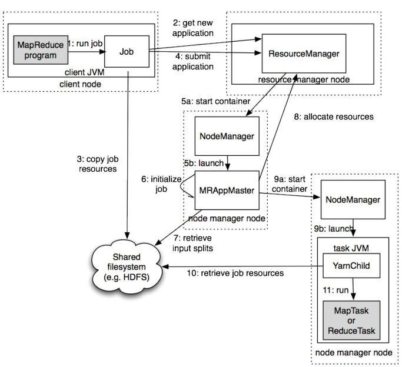

## Chap 6: How MapReduce Work

### MapReduce
- `mapred.job.tracker`
  - if set as local, job will be executed using local machine
  - if set as a host:port, then job will be submitted to remote host
- `mapreduce.framework.name` will set the framework
  - `classic`: use one jobtracker and multiple tasktracker
  - `yarn`: a new framework
- `Classic` MapReduce
  - client: submit MapReduce job
  - `jobtracker`: coordinate jobs
  - `tasktracker`: exceute the divised jobs
  - `HDFS`: distributed file system, use to share files 
- How it works

- `JobSummiter` Procedure
  - send request to `jobtracker` for new job id
  - copy required resources to a file named using jobid, in the file system of jobtracker
- Communication
  - use `heartbeat`
  - when the tasktracker is ready for new job, jobtracker will assign it a new task
  - for map job, job tracker will select th tasktracker that is closer to the required files
  
- Task execution
  - tasktracker wil first copy the required files to local
  - then new a  `TaskRunner` to run the job
    - `TaskRunner` will use a JVM for each map or reduce job
  - child process communicates with parent process via `umbilical`
- Streaming
  - output/intput communicate with process
- Pipes
  - listen to socket

### YARN (Yet Another Resource Negotiator)
- Motivation
  - classical approach meets bottle neck when cluster nodes exceed around 4000
- Jobtracker 
  - dispatch jobs, task monitor
- two manager
  - Resource Manager
  - Application Manager
    - monitor life-cycle
    - Each MapReduce job has a application master
- Benefits
  - different YARN application can co-exist on the same cluster 
- YARN MapReduce Procedure

### Job Scheduling
- `setJobPriority()`: jobs have the following priorities, `VERY_HIGH`, `HIGH`, `NORMAL`, `LOW`, `VERY_LOW`
- Note it uses FIFO, and not allowed preemption

### Shuffle and Sort
- each map task will have a `buffer` memory, when buffer memeory is full, the contents will be `spill` to disk
  - each time when the buffer memeory is full, a new file named `spill file` will be created
  - when there are many `spill` files (>=3), `combiner` will be called
  - when write to disk, it may use `compress`
- when write to disk
  - it will determine the partition based on what will be done in the `reduce` process
- reducer
  - reducer get the data by `HTTP`
  
### JVM Reuse
- Hadoop execute tasks in JVM
  - Launch a JVM costs 1s
  - a tasktracker can execute multiple tasks at the same time, but in different JVMs
  
###　Skipping Mode
- avoid an error in data cause the map-reduce process to stop
- the error results skipped will be kept in `_logs/skip`
