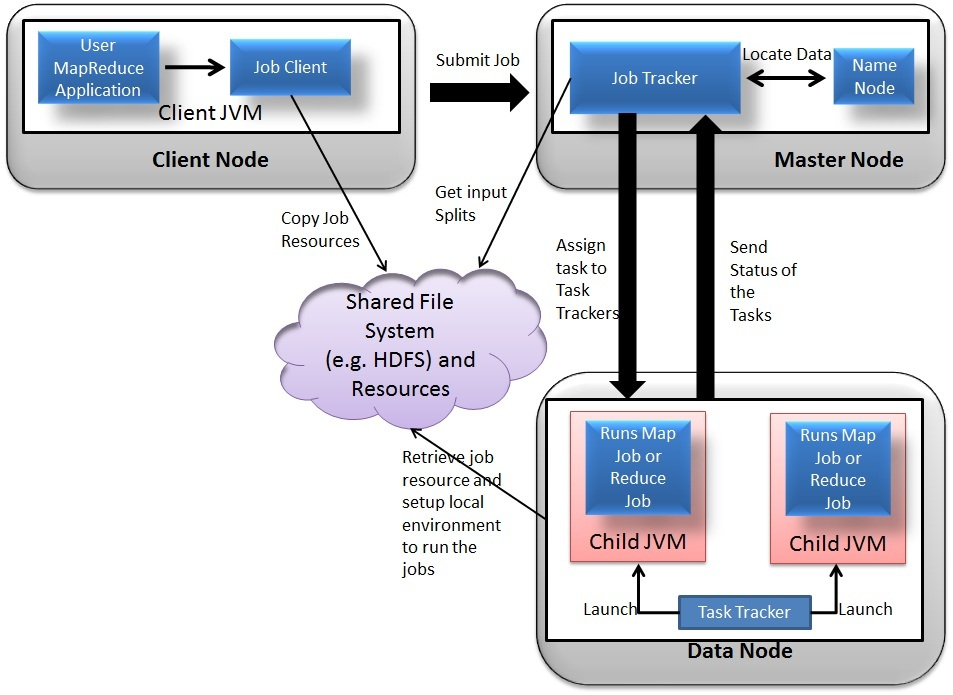

## How MapReduce Work

### MapReduce
- `mapred.job.tracker`
  - if set as local, job will be executed using local machine
  - if set as a host:port, then job will be submitted to remote host
- `mapreduce.framework.name` will set the framework
  - `classic`: use one jobtracker and multiple tasktracker
  - `yarn`: a new framework
- `Classic` MapReduce
  - client: submit MapReduce job
  - `jobtracker`: coordinate jobs
  - `tasktracker`: exceute the divised jobs
  - `HDFS`: distributed file system, use to share files 
- How it works

